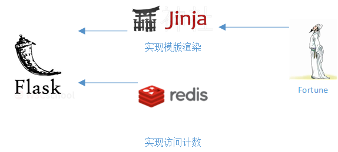
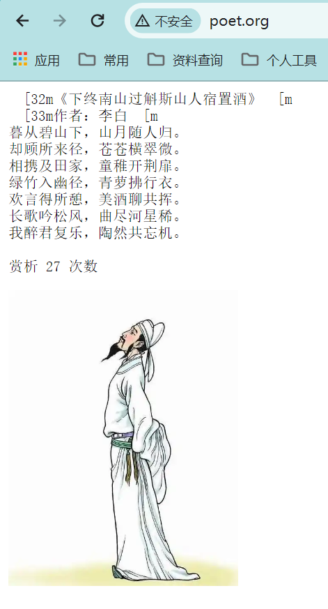

# flask_poet
使用FLASK创建应用：自动作诗

# 使用FLASK创建应用：自动作诗
> 

        诗仙 1.0

# 1.概述

> 

    在上节课的基础上，增加如何调用业务处理的逻辑过程，各个模块各司其职：
        动态页面 - Flask Jinja
        访问/作诗计数器 - Redis 缓存
        诗词自动生成 - Fortune-zh

# 2.使用说明

```shell
cd flask_poet

# 构建
docker-compose build
...

# 创建并启动
docker-compose up -d
[+] Running 2/0
 ✔ Container flask_poet-redis-1  Running                                                                           0.0s
 ✔ Container flask_poet-web-1    Running


# 构建成功会在主机生成镜像：poet:1.0
docker-compose images
CONTAINER            REPOSITORY          TAG                 IMAGE ID            SIZE
flask_poet-redis-1   redis               alpine              f597a450f464        40.7MB
flask_poet-web-1     poet                1.0                 a4601a9314ff        192MB

# 测试
curl http://www.poet.org/
<meta HTTP-EQUIV="Content-Type" CONTENT="text/html; charset=utf8">
<pre>
《贾生》
作者：李商隐
宣室求贤访逐臣，贾生才调更无伦。
可怜夜半虚前席，不问苍生问鬼神。

赏析 1 次数
</pre>

```
# 3.浏览器访问 http://www.poet.org
> 
