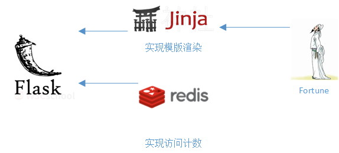
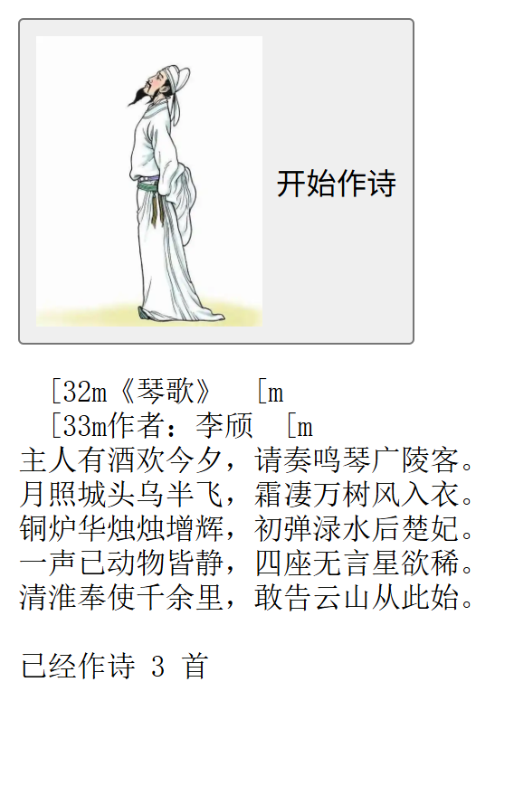

# flask_poet
使用FLASK创建应用：自动作诗机器人 v1.0

# 1.概述

> 

    模块说明：
        动态页面 - Flask Jinja
        访问/作诗计数器 - Redis 缓存
        诗词自动生成 - Fortune-zh

# 2.使用说明

```shell
git clone https://github.com/flyjjbb/flask_poet.git
cd flask_poet

# 构建
docker-compose build poet
...

# 构建成功会在主机生成镜像：poet:1.0
docker images
REPOSITORY              TAG             IMAGE ID       CREATED         SIZE
poet                    1.0             2bdd8a930783   7 hours ago     282MB

# 创建并启动
docker-compose up -d
[+] Running 2/0
 ✔ Container flask_poet-redis-1  Running                                                                           0.0s
 ✔ Container flask_poet-web-1    Running

# 查看启动的容器：应用和数据库
docker-compose images
CONTAINER            REPOSITORY          TAG                 IMAGE ID            SIZE
flask_poet-redis-1   redis               alpine              f597a450f464        40.7MB
flask_poet-poet-1    poet                1.0                 a4601a9314ff        192MB

# 测试
curl localhost:8000
<meta HTTP-EQUIV="Content-Type" CONTENT="text/html; charset=utf8">
<button style="display:flex;align-items:center;padding:6px;cursor:pointer;" onclick="location.reload()">
    
    开始作诗
</button>
<pre>
《登楼》
作者：杜甫
花近高楼伤客心，万方多难此登临。
锦江春色来天地，玉垒浮云变古今。
北极朝廷终不改，西山寇盗莫相侵。
可怜后主还祠庙，日暮聊为梁父吟。

已经作诗 2 首
</pre>
```
# 3.浏览器访问 localhost:8000，点击图片按钮开始作诗。
> 
